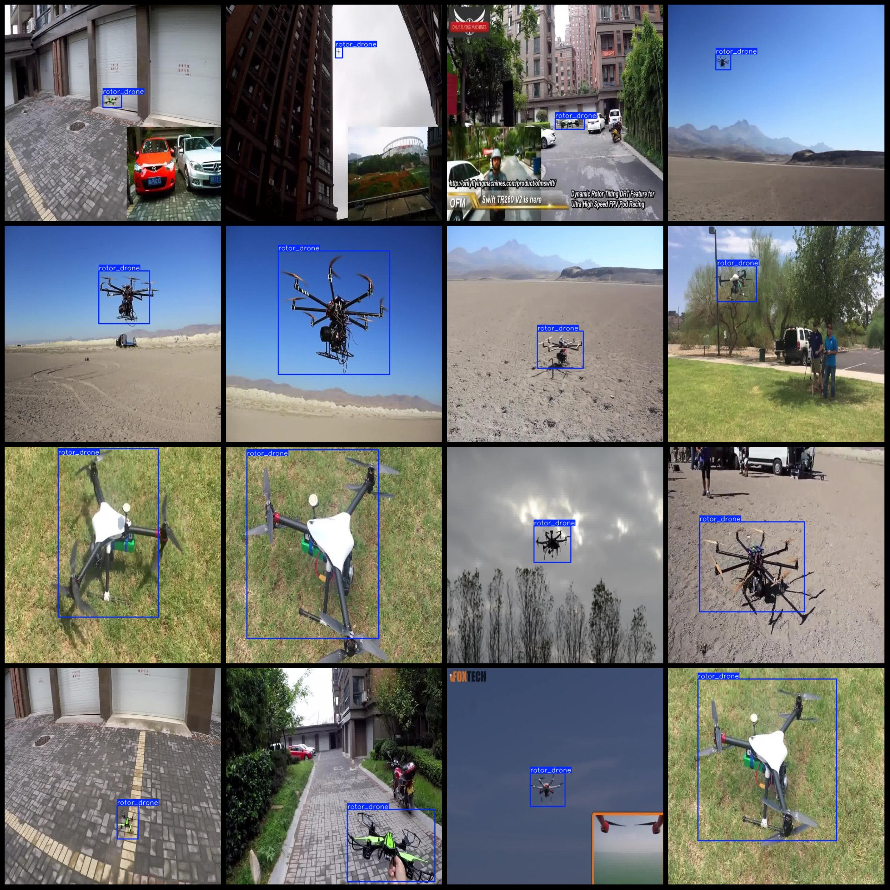

# Vision Detection Dataset (VOC+YOLO) in 1462 Categories

The dataset is in Pascal VOC format plus YOLO format (excluding the split path txt files, only containing JPG images along with corresponding VOC format xml files and YOLO format txt files).

Number of images: 1462
Number of labeled files: 1462
Number of labeled files: 1462
Number of labeled categories: 1
Labeled category name: ["rotor_drone"]
Number of boxes per category: 1510
Total number of boxes: 1510
Number of images per category: 1462
Image resolution: 640x640
Annotation tool used: labelImg
Annotation rules: Draw a box around the category
Important note: The dataset does not have separate training, validation, or test sets; you will need to divide it yourself.
Special statement: This dataset does not guarantee the accuracy of the trained model or weight files.
Image preview:
## Images

Here is a pay link on Stripe ( https://buy.stripe.com/3cs8yP7sY87d0vu9AB ). Please contact me lonlonago@foxmail.com after funding $89, and I will send you a complete data files , thank you!

